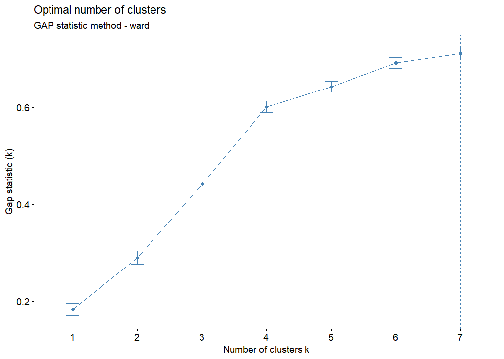
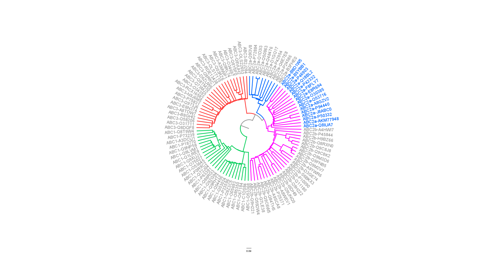
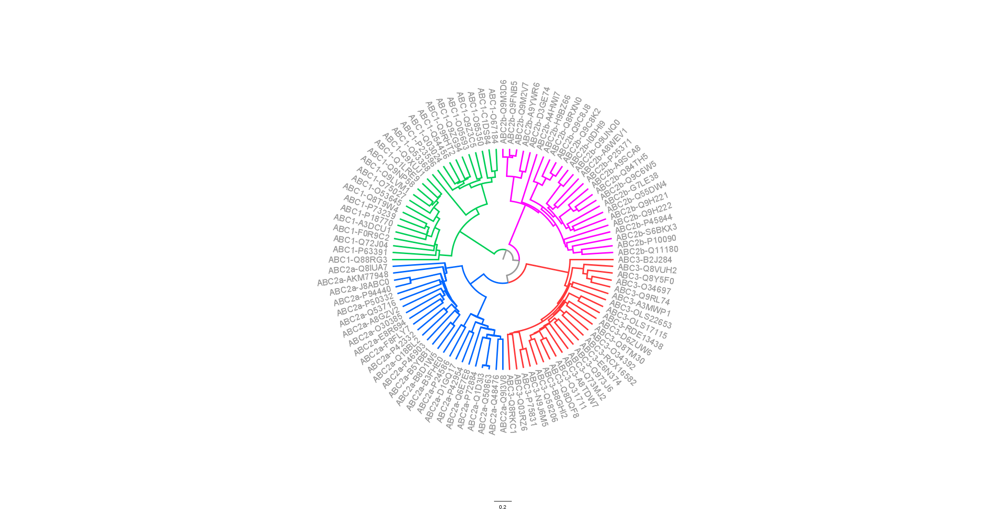
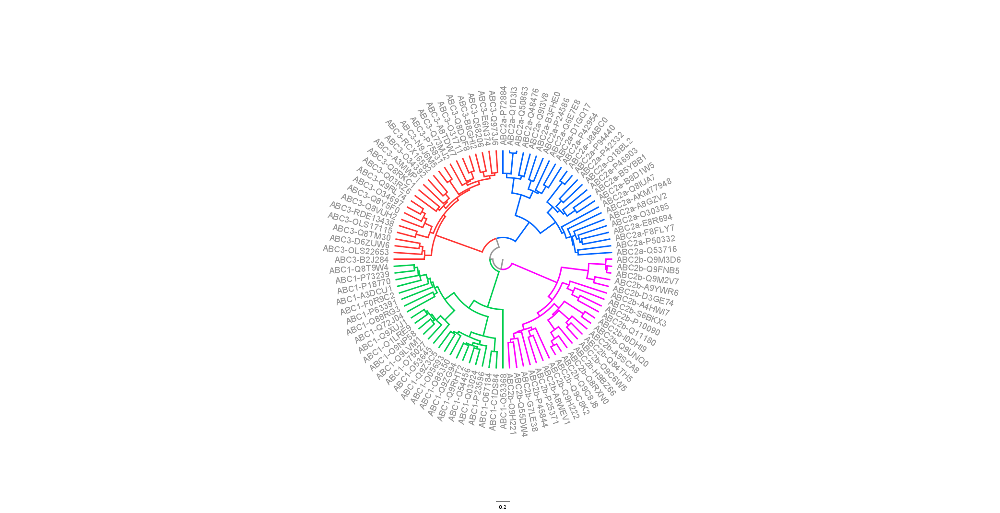
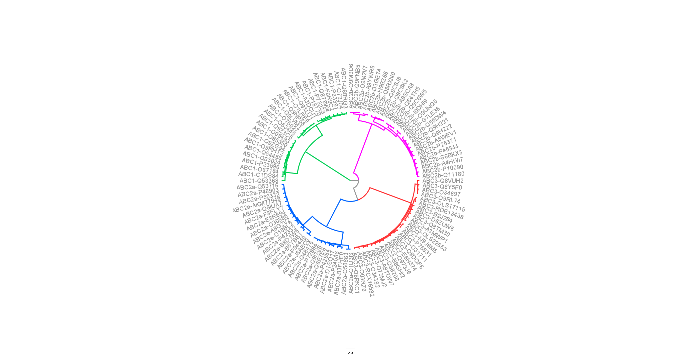

# ABC family proteins clustering

### Written by [Ethan Galindo Raya](https://ethan-gr.github.io/ethangr.io/) and [Diego Carmona Campos](https://diego-carc.github.io/diego-carc.io/)

### Introduction 
The ATP-binding cassette (ABC) proteins are a family of ATP-dependent transporters in charge of the movement of a wide variety of substances across the plasmatic membrane and several intracellular compartments. Since these proteins are almost ubiquitously found in all kinds of organisms, from prokaryotes to animals, it is speculated that they originated very early in life evolution and have diverged in different subfamilies to span a greater variety of biological functions [1]. 

According to the evolutionary mechanism that gives rise to gene homologs (duplication and divergence by mutation), it is expected that closely related family members share a greater amino acid sequence identity than distantly related ones. Thus it is reasonable that applying a hierarchical clustering algorithm on the sequence similarity data of a set of protein homologs would reflect the phylogenetic relationship of those proteins. In this project, we employ four hierarchical clustering methods to group a set of ABC proteins based on a distance matrix built from the bitscore of pairwise alignments using BLAST. 

It is important to consider that we do not fully know where the data was taken from, nor the relationship between the sequences analyzed. The only hint available is found in the sequence identifiers in the [fasta file](https://github.com/diego-carc/ProyectoFinalClustering/blob/master/data/ABC.faa). In a real study, we should have a better understanding of the sequences under analysis to properly interpret the results.

### Cluster number estimation
Before performing hierarchical clustering, we applied three methods to estimate the number of clusters in the data. We use the WSS, Silhouette, and Gap statistic methods using k-means and Ward as clustering algorithms, generating the six images available in the [figures directory](https://github.com/diego-carc/ProyectoFinalClustering/tree/master/figures). Here we show the results of the Gap statistic method using the hclust implementation of the Ward algorithm. 

Despite the method suggested a total of seven clusters, we observed the other methods came to a consensus of four clusters (not shown). Even in this figure, we observe the first significative slope change is given by four clusters, then the function gets stable. Thus we picked four as our expected number of clusters.

### Figures and interpretation

#### Single linkage method

#### Complete linkage method

#### Average linkage method

#### Ward method

We observed that three out of four phylogenies obtained are congruent with the protein's taxonomies, the only exception being the single linkage tree, which clusters some proteins ABC-2a within ABC-2b (The ones we remak taxa in blue on the Single linkage tree figure).

However, it might be more informative since is noteworthy as ABC-2a and ABC-2b are taxonomically closer and we would expect them to be close in a phylogeny. While other methods separate them into distant clades and cluster ABC-2a closer to the ABC-3 clade.

It might be a result of an intern clusters separation in ABC-2a clade (which is evident in the Ward tree figure). The proteins that are being considered in ABC-2b that belong to ABC-2a might be proteins that haven't had a strong differentiation process, resembling a midpoint between ABC-2a and ABC-2b. And this midpoint-like group on the data may make the group ABC-2a look apparently closer to ABC-3 rather to ABC-2b.

On the other hand, the phylogeny recovered by the ward method appears less informative. While it correctly separates proteins into the expected clusters, they are considerably distant from each other, despite we know that that all the 100 proteins are homologous.

Although the method minimizes variance among groups, it fails to reflect the biological reality of their relationships. The distance portrayed may suggest significant divergence, like if they were different types of proteins, making it the least informative tree. 

### What is the tree with the highest agglomerative coefficient?
We summarize the obtained agglomerative coefficients in the following table:

| Method   | Agglomerative Coefficient |
|----------|--------------------------:|
| Single   | 0.61                      |
| Average  | 0.71                      |
| Complete | 0.77                      |
| Ward     | 0.98                      |

The Ward method gave us the highest agglomerative coefficient. However, as we have previously discussed, the interpretation of the results can't be agnostic  to the biological context of the data, so the fact that Ward performed the best in terms of agglomerative coefficient doesn't mean it will generate the best tree. 

### Data availability and results
The original [fasta file](https://github.com/diego-carc/ProyectoFinalClustering/blob/master/data/ABC.faa), the [distance matrix](https://github.com/diego-carc/ProyectoFinalClustering/blob/master/results/disimMatrix.tsv), and the [figures](https://github.com/diego-carc/ProyectoFinalClustering/tree/master/figures) are available at our [GitHub repo](https://github.com/diego-carc/ProyectoFinalClustering.git).

### References
1. Vasiliou, V., Vasiliou, K., & Nebert, D. W. (2009). Human ATP-binding cassette (ABC) transporter family. Human genomics, 3(3), 281–290. [https://doi.org/10.1186/1479-7364-3-3-281](https://doi.org/10.1186/1479-7364-3-3-281)
